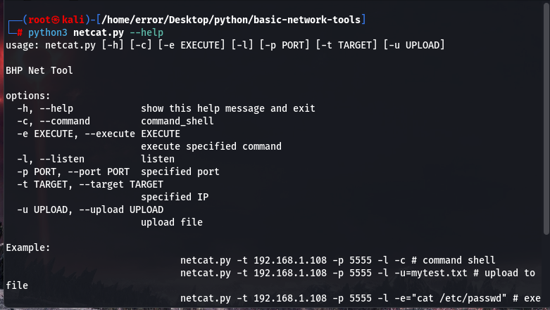
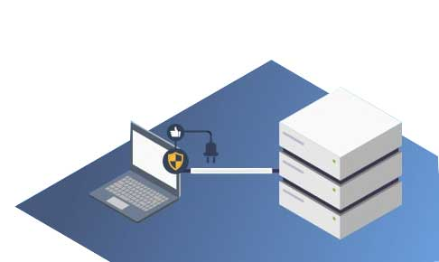
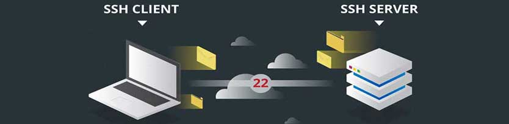
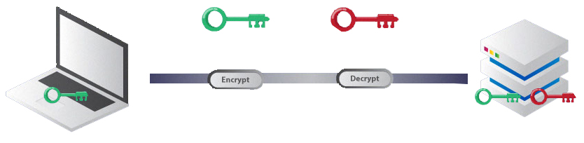
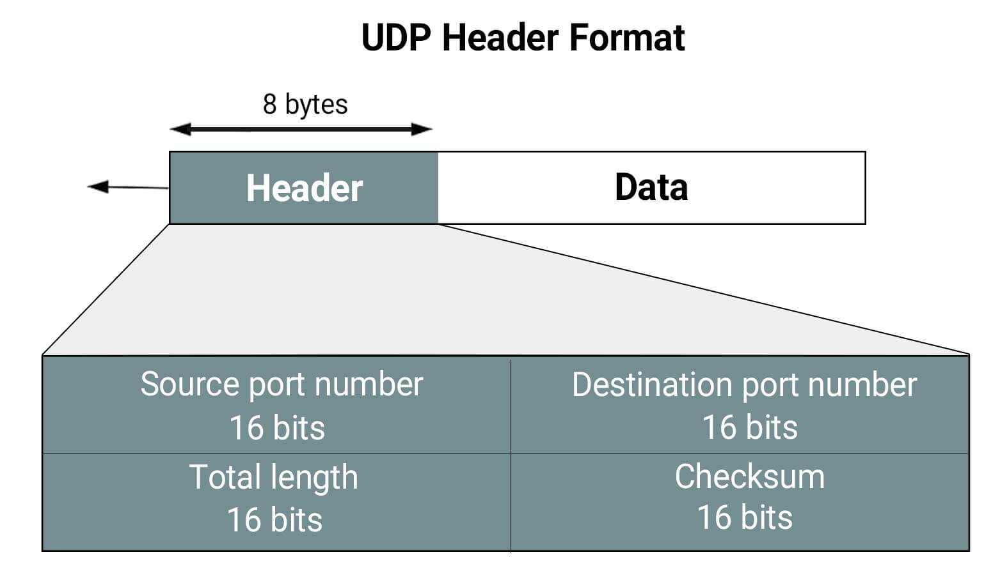
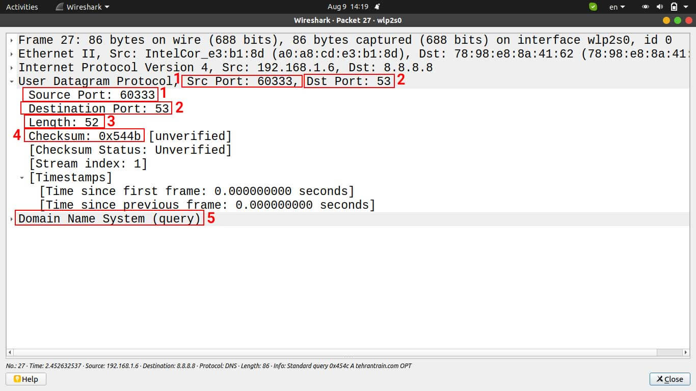
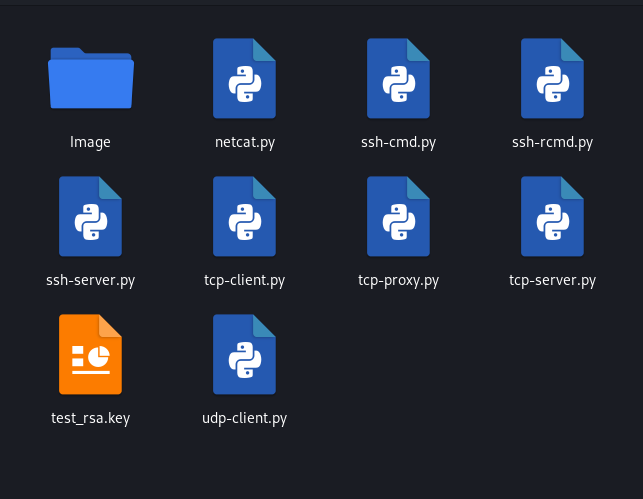

<br/>
<p align="center">
  <a href="https://github.com/ShaanCoding/ReadME-Generator">
    
  </a>

  <h3 align="center">‌Basic Network Tools</h3>

  <p align="center">
    A folder of basic networking tools written in Python
    <br/>
    Note this project is done.
    <br/>
    <br/>
    <!-- <a href="https://readme.shaankhan.dev"><strong>View Demo »</strong></a> -->
    <br/>
    <br/>
    <a href="https://intsagram.com/error._.fiat">Our instagram page</a>
    .
    <a href="https://youtube.com/error_fiat">Our youtube chanel</a>
    .
    <a href="https://twitter.com/ErrorFiat">Our twitter page</a>
  </p>
</p>

## Tools in the folder

- netcat
- ssh_cmd
- ssh_rcmd
- ssh_server
- tcp_client
- udp_client
- tcp_server
- tcp_proxy

## Whats NetCat?

> Netcat is a communication tool through Tcp and Udp ports, by using this tool we can establish a connection between two operating systems!

Netcat (often abbreviated as Nc) is a network tool for reading and writing to network connections using TCP or UDP. This command is designed as a reliable backup that can be directly or easily driven by other programs and scripts. At the same time, it's a feature-rich network debugging and research tool, as it can generate almost any type of communication a user might need, and has a number of built-in capabilities!

* As a result, Netcat or Swiss Army Knife is one of the most common and famous hacker tools!



This is a Netcat sample that we put in this folder to make the tools more complete

## What is SSH? and its application in the network

What is SSH or Secure Shell? is a remote management protocol that allows users to control and modify their remote servers over the Internet. This service was created as a secure alternative to Telnet, which was unencrypted, and uses cryptographic techniques to ensure that all communications through the remote server are encrypted. It provides a mechanism for remote user authentication, data transfer from the client to the host, and back to the client.



As mentioned, SSH is also known as Secure Shell or Secure Socket Shell. A network protocol that provides users, especially system administrators, with a secure way to access computers over an insecure network. SSH also refers to the set of tools that implement the SSH protocol. Secure Shell provides strong authentication and encrypted data communications between two computers connected over an unsecured network such as the Internet. SSH is widely used by network administrators to manage systems and applications remotely, allowing them to log into another computer over the network, execute commands, and transfer files from one computer to another. .

## How does SSH work?

SSH refers to both the cryptographic network protocol and the set of services that implement the protocol and uses a client-server model. SSH can also be used to create secure tunnels for other application protocols, for example, to run remote X Window System graphical sessions. But what is the SSH port? By default, the SSH server listens on Transmission Control Protocol (TCP) port 22.



While SSH can be used with a regular username and password as credentials, SSH relies more on public key pairs to authenticate hosts to each other. Users must use their username and password (or other authentication methods) to connect to the "remote host". In addition, the local device and the remote device are authenticated separately. This is done by generating a unique public key pair for each host in the communication. A single session requires two public key pairs: one public key pair to authenticate the remote device to the local device and another public key pair to authenticate the local device to the remote device.
SSH connections for securing various types of communications between a local machine and a remote host, including secure remote access to resources, remote execution of commands, delivery of software patches and updates, and other administrative or administrative tasks. it has been used.




## What is the UDP protocol?

The UDP protocol works in layer 4 (Transport) of the OSI model and its task is to receive data from the sender application in the source computer and manage its transfer to the destination computer and deliver it to the data receiver application. UDP's attempt is to get the data to its counterpart in the destination machine as quickly as possible. UDP protocol identifier is number 17 and IP protocol communicates with this protocol through this number and delivers the packet received from the network to it. UDP is the interface between the IP protocol and applications in layer 7 (Application) of the OSI model that want data to reach the destination computer as soon as possible.

Usually, the management of sending and receiving data related to live audio and video communications, such as conferences and audio and video phone calls, multi-user online games, Internet TV, etc. It is done by UDP protocol. In addition to these applications, some common TCP/IP network protocols such as DNS protocol and DHCP protocol also use udp to transfer their data. This protocol in the source machine does not coordinate with UDP in the destination machine and without prior notice and confirmation from the opposite computer, it delivers data to the IP protocol to send, address and package the IP packet. In fact, UDP acts like an uninvited guest and enters the house without any coordination with the host.

## Duties of the UDP protocol:

- Receive data from applications and deliver it to the IP protocol for transmission in the network.
- data packaging. These data packets are known as Datagram in UDP literature.
- Add source and destination port number in UDP header. The UDP protocol on the destination computer knows which application should deliver the data through the destination port number (UDP Destination Port). It can also give the source answer through the source port number (UDP Source Port).
- Discover whether the received data is healthy or damaged on the network path.

## Check UDP Header



The UDP Header is 8 bytes in size and has 4 fields totaling only 64 bits (8 bytes) in length. UDP Header fields include the following:

UDP Source Port
The first field of UDP Header which contains 16 bits (2 bytes). Port number can be set from 0 to 65535. The UDP Source Port number is the address of the application program on the computer sending the data, and it is placed in the header so that the destination computer can return the response to the application program with its help.

UDP Destination Port
The UDP Destination Port field contains 16 bits (2 bytes). Destination Port Number can be set from 0 to 65535. With the help of this field, the application that is the recipient of the package is identified in the destination machine and the package is delivered to it by UDP.

UDP Message Length
16-bit field (2 bytes) that indicates the size of UDP Header and UDP Data.

UDP Checksum
The size of this field is 16 bits (2 bytes) and is used to determine the health of the packet. Checksum is a mathematical operation that is used to ensure that the contents of the datagram do not change during the journey to the destination computer. If the data in the path has been changed for any reason, the result of the mathematical algorithm used in the source and destination will not be the same, and this indicates that the UDP packet is damaged and should be discarded. checksum is the last field in the UDP header, and after that, the data is sent to the destination application.



- Number 1: In the image above, we checked DNS protocol traffic with the Wireshark application. Number 1 refers to the Source Port field of the UDP Header of a DNS Query packet that is supposed to be sent from the DNS Client to the DNS Server. The client port number is randomly selected. In response to the client, the server also puts the destination port number in the UDP Header as the same random number that the client has set for itself.

- Number 2: In the picture above, it refers to the UDP Destination Port field of the UDP header, which is the address of the DNS Server program on the server computer. DNS Server uses UDP53 port to communicate with the client.

- Number 3: It shows the size of the UDP packet when it is encapsulated and delivered to the IP protocol in layer 3 of the OSI model.

- Number 4: The UDP protocol supports a feature called Checksum, which is used for Error Detection. Checksum is a process that is executed by UDP on the source computer, and based on it, a mathematical operation is performed on the data and its numerical result is written in a field called Checksum in the UDP header, so that UDP performs its numerical result of Checksum with the numerical result of Checksum on the destination computer. done in the source computer to compare. Therefore, at the destination, the same mathematical operation is performed on the UDP packet. If the number of checksums of the source and destination are equal, it means that the data has reached the destination without any errors or manipulations and no damage has been done to it on the way to the network; Otherwise, UDP does not deliver the data to the application and discards it.

- Number 5: refers to the DNS message that is packaged by UDP and ready to be sent to the destination. As you can see in the picture, UDP delivers the packet to the IP protocol, and after encapsulating, the IP protocol delivers it to the Ethernet protocol to be sent to the destination through the network card.


## Comparison of UDP protocol with TCP

By examining the fields of these two protocols, their similarities and differences are easily revealed. TCP has more characteristics and details than UDP, and this makes the TCP protocol more accurate than the UDP protocol in the way of packaging and sending data, and as a result, it can guarantee the delivery of data to the destination. But UDP has higher speed and less delay for sending data.

There is nothing in the UDP Header other than absolute requirements such as Source Port and Destination Port for a scheduled delivery. But TCP has a lot of information in its header, which are used to support various features of this protocol, including flow control, sequence, confirmations, as well as retransmission ability; For this reason, it has a lower speed than UDP in sending data. TCP and UDP together form a good team. These two protocols are data-centric and do not know anything about the network; As a result, both of them must rely on the IP protocol to send data.

## About The Project



A complete folder of basic networking tools in the Python programming language to help complete your code and take patterns to write more complete and useful code.

## Built With

Whilst I was the main developer of this project, this project couldn't of even started without the help of these open source projects, special thanks to:

- [[Python]](https://www.python.org/)

## Getting Started

This is an example of how you may give instructions on setting up your project locally.
To get a local copy up and running follow these simple example steps.

### Prerequisites

This program has no pre-requisites

### Installation & Usage

1. Clone the repo

```sh
git clone https://github.com/errorfiathck/basic-network-tools.git
```

2. cd to directory

```sh
cd basic-network-tools
```

3. Have fun!
